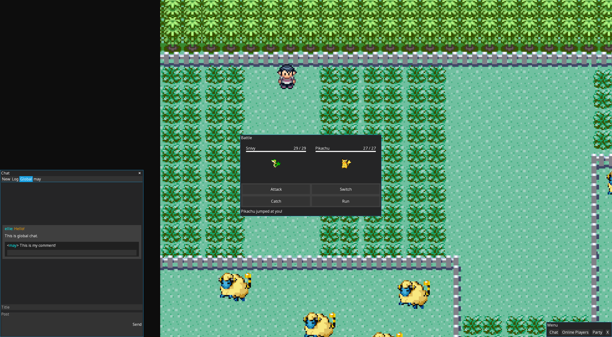
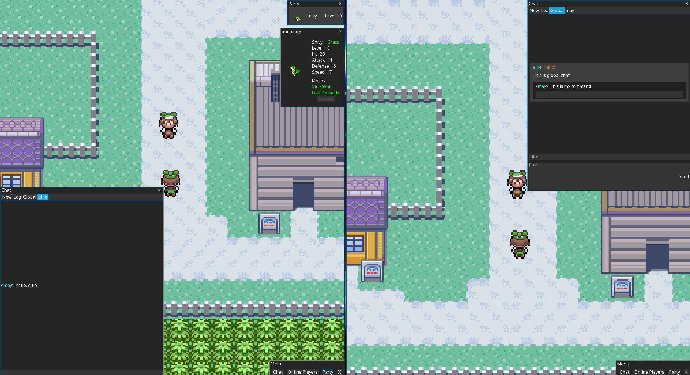
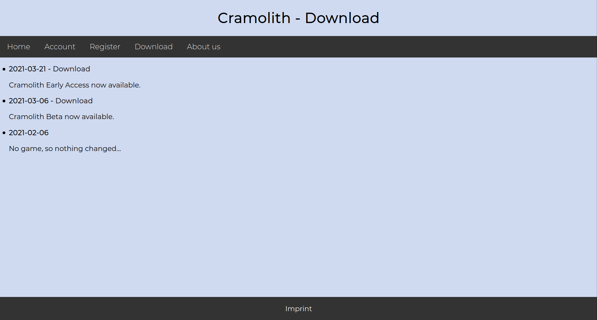

# Cramolith

A pokemon-like battle MMO.

## Features

- Fully multiplayer/online
- Custom built website and account system
- Ability to catch and fight Pokemon
- Fully fledged chat system

## Showcase

Fighting against a wild Pokemon while chatting in global chat:


2 game instances chatting with one another along with being able to see their avatar in-world:


The game's download page


### Build

``` bash
# Run on desktop
./gradlew desktop:run

# Create jarfile
./gradlew desktop:dist
```

### Code style

Follow Kotlin official style guide: https://kotlinlang.org/docs/reference/coding-conventions.html
Max line length is 150.

### Credit

Sprites in this game were mostly taken from The Spriters Resource. Thanks to the creator of the sheets, *Furs the Fox*.